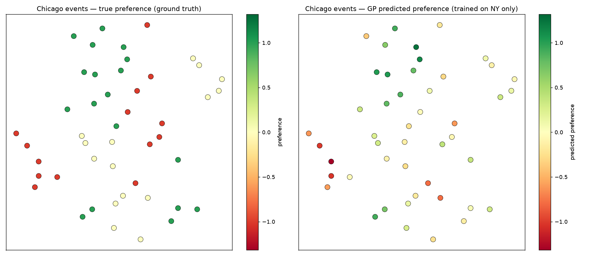
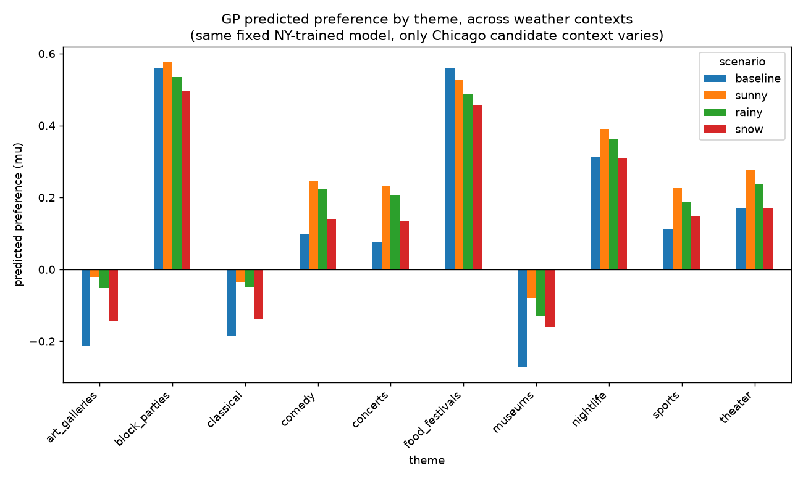
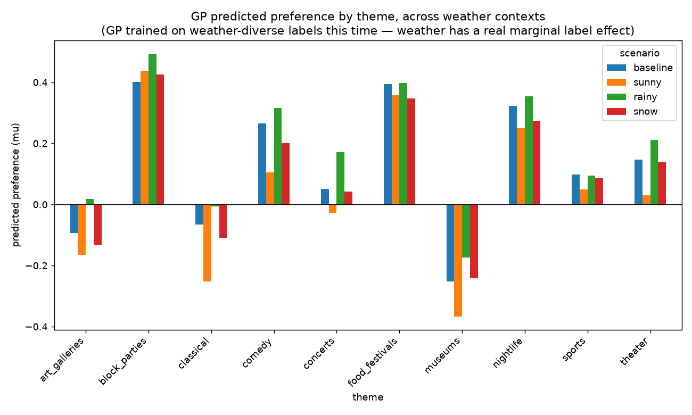

# Event search + preference transfer

A small pipeline that searches for real local events, embeds them, and tests whether a learned "taste" model transfers from one city to another it's never seen.

## How it works

### 1. Search

Claude gets one tool: `brave_search`. Instead of a single query, it's told to start broad and refine its own search if the first results are too generic — adding exact dates, neighborhoods, venue names, event series names it picks up along the way. This is close to how Claude Code's own web search behaves: cheap, iterative re-querying beats one search plus heavy page-fetching. In testing, letting the model re-search surfaced real, dated, located events (cross-checked against primary sources) where a single generic query just returned stale listing pages.

Output is a flat dict per city: `{url: {description, theme}}`.

### 2. Embeddings

Anthropic doesn't have its own embedding model — Voyage AI is their recommendation, but it needs a separate account and key. This project uses a free local model instead, `all-MiniLM-L6-v2` via `sentence-transformers`. Each description is prefixed with today's date before embedding, so the context string has room to grow later (price, distance, whatever) without restructuring anything.

### 3. Preference transfer

A Gaussian Process is fit on one city's embeddings against a preference label. A second city's events get run through the same GP, and Thompson sampling draws from the posterior to pick candidates — the usual explore/exploit move if this were feeding a real recommender instead of a demo.

## Demo: New York → Chicago

Real preference labels aren't available, so this uses synthetic ones: a fixed persona (likes concerts, nightlife, food festivals, block parties; dislikes museums, classical, art galleries; neutral on sports, comedy, theater) generates a noisy −1/0/1 label for each NY event.

**Training** — GP fit on 50 NY events: embedding in, synthetic label out. The GP never sees the theme, only the embedding.

**Validation** — the same GP, still never shown a single Chicago event, predicts on 50 fresh Chicago events. Correlation with Chicago's true (synthetic) preference: **0.70** for the posterior mean, **0.58** for a single Thompson sample (noisier, which is expected — that's the exploration term doing its job).

### What the transfer looks like

Left is ground truth, right is what the NY-only GP predicts, both laid out with the same t-SNE projection of the Chicago embeddings. The color gradients roughly line up — events that should read as "liked" skew green in both panels, "disliked" skews red. No Chicago label, theme name, or city name went into the prediction side. Just the geometry an NY-trained model learned, applied to a city it's never seen.

**[Interactive version](chicago_transfer_interactive.html)** — same chart, but hover any point for that event's description. Open the file directly in a browser (static image previews, like GitHub's, won't run the hover).

## Follow-up: does situational context transfer the same way?

The city experiment tests one axis: do event *descriptions* generalize to a place the model's never seen. The natural second question is the other axis — does *context* (the date prefix every embedding already gets, with room to add more later) actually do anything useful, or is it just along for the ride?

Weather was the test case: does telling the model "it's snowing" shift recommendations toward indoor events, the way it should for a real person deciding what to do that night.

### Attempt 1 — context with no training signal

Same NY-trained GP as the main demo (labels are theme-only, nothing about weather). Only the Chicago candidate side changes: embed each event with a weather sentence spliced in ("Sunny and 75°F outside today," "Snowstorm, 20°F," etc.) and see if predictions shift the right way.

**[Interactive version](weather_naive_interactive.html)** — one dot per event, hover for its description. The bar-chart version above shows the per-theme mean; this one shows the actual spread the mean is hiding.

They shift — just not usefully. Every theme moves in the same direction regardless of category: sunny scores highest, snow lowest, indoor and outdoor themes alike. That's not a weather-appropriateness effect, it's the weather sentence's general valence ("sunny and 75°F" reads pleasant, "snowstorm" reads harsh) nudging every embedding by roughly the same amount. The outdoor/indoor gap stays flat across sunny → rainy → snow instead of shrinking the way it should if bad weather were actually suppressing outdoor events.

Makes sense in hindsight: the GP was never shown a single example where weather changed the right answer. There's no reason it would've picked that up for free.

### Attempt 2 — context with an actual (marginal) label effect

Rebuilt the NY training labels so weather has a real but small causal role: each of the 50 NY events gets a random "historical weather" at label-generation time, and indoor/outdoor themes get nudged ±0.2–0.5 in the appropriate direction (on top of the ±1 base theme preference). Trained one GP on this weather-aware set, then repeated the Chicago prediction across weather scenarios.

**[Interactive version](weather_trained_interactive.html)** — same per-event view, hover for description.

Better, but weak. The indoor themes (museums, classical, art galleries) do score higher in rain than in sun, which is the right direction — but snow doesn't continue the trend the way it should, and the outdoor themes show no consistent pattern at all. Most likely cause: 50 points split across 4 weather conditions and 10 themes works out to roughly 1–2 examples per weather×theme cell — nowhere near enough to resolve a two-way interaction on top of label noise (std 0.4, comparable to the weather effect itself). The single theme→label effect worked cleanly at this sample size; asking the same 50 points to resolve theme *and* weather at once is a much higher bar.

### Takeaway

Context doesn't transfer for free just by being concatenated into the embedding text — the frozen embedding model won't infer an interaction the training labels never contained. If a real version of this needs context-conditional recommendations, the options are: encode it explicitly (tag events indoor/outdoor, combine with weather via actual logic, not an embedding), or feed the GP enough examples per context condition to actually learn the interaction — which costs data, not just a longer prompt.

Both experiments reused already-collected descriptions — no new search calls, so no additional Anthropic/Brave cost beyond the one NY+Chicago refresh (~$1.08) used to regenerate the dataset after the scratch cache was cleared.

## Caveats

- 50 points in 384 dimensions is a small training set. The GP's noise term converged to its lower bound during fitting, which usually means it's fitting NY's noise a little too closely rather than the underlying signal. More data would firm this up.
- Labels are synthetic. The goal was testing whether structure transfers through the embedding space, not modeling real taste.
- Concerts was the one theme that didn't transfer well (near-zero instead of clearly positive) — likely just noise at n=5 per theme.
- Total cost for the full NY + Chicago run: **~$1.16** (Claude Sonnet 5.5 search agent; embeddings are free, local).

## Files

- `agentic_search.ipynb` — the search → embed → GP/Thompson-sampling pipeline, runs top to bottom
- `keys.md` — API keys. Not committed anywhere. Don't share this file.
- `*_interactive.html` — ggplot2-styled, hover-for-description versions of the charts above (Plotly, loads its JS from a CDN so the files stay small — open directly in a browser, not through GitHub's preview)
