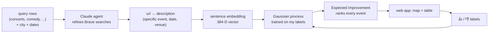
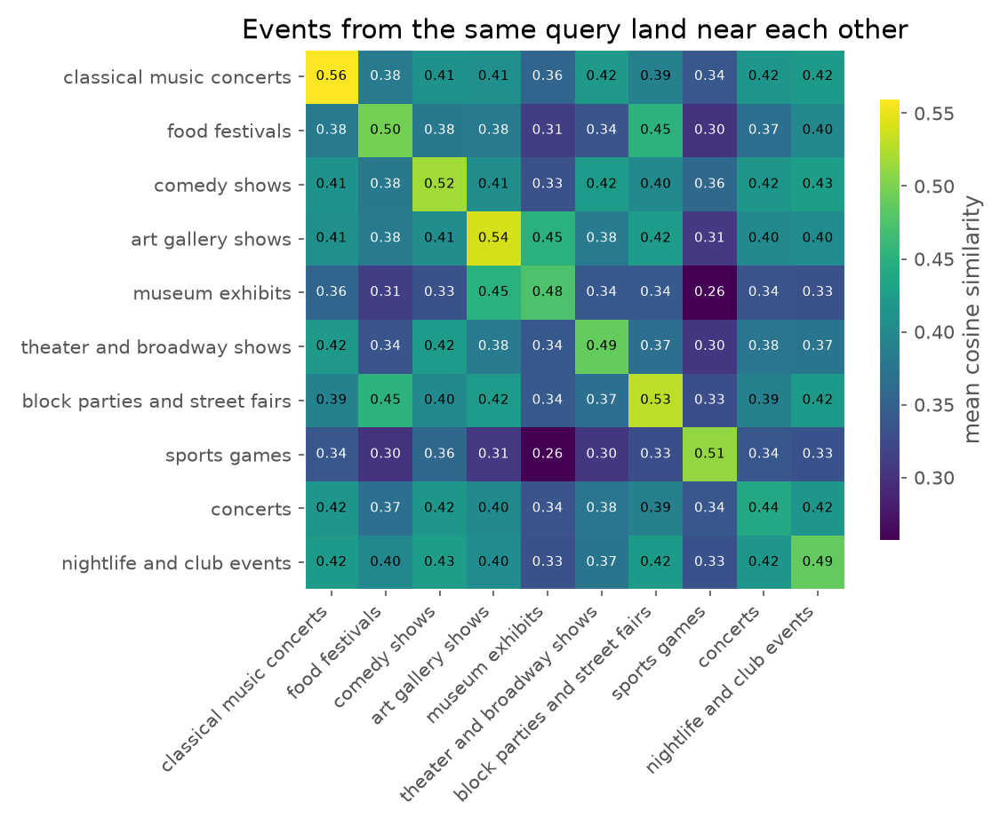
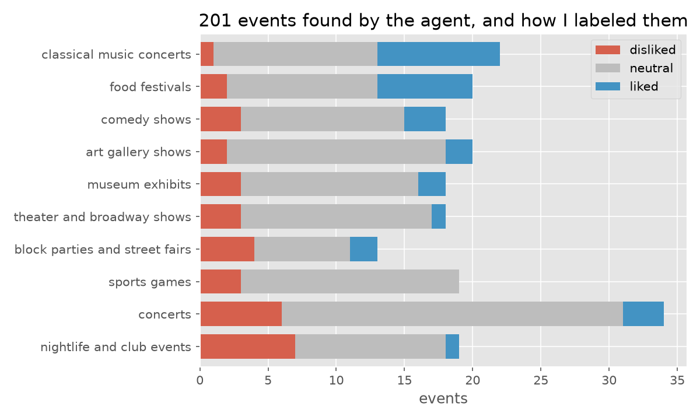
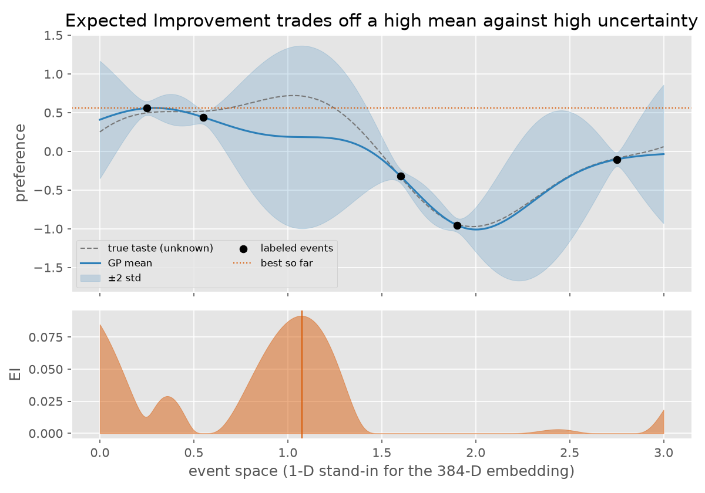
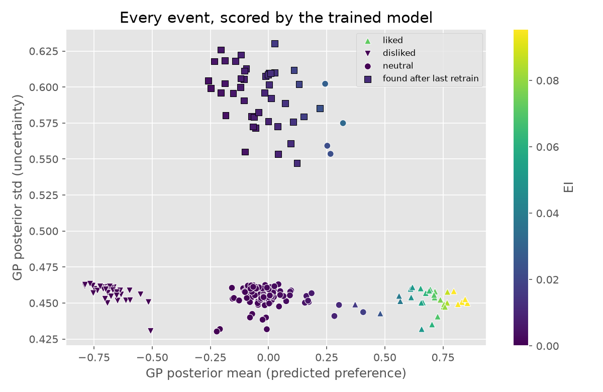
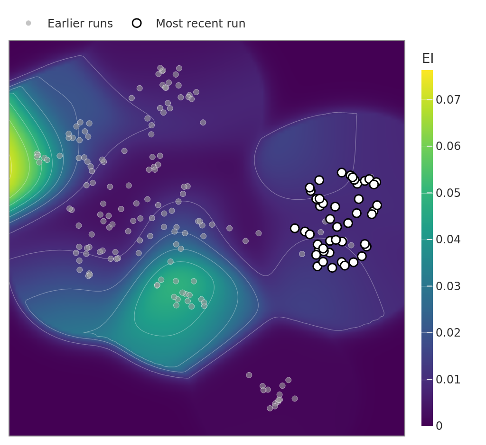

# Recommending events with an agent and Bayesian optimization

Every week I want to know what's on in my city that I'd actually enjoy. The listings exist, but they're
scattered across venue sites, ticketing pages, local blogs and SEO round-ups, and none of them know anything
about my taste.

This project treats that as two separate problems:

1. **There's no catalog to recommend from.** Classic recommenders assume a table of items with features.
   Here an LLM agent *builds* that table: it searches the web, chases vague results down to specific dated
   events, and writes a description of each one. That description is the event's feature.
2. **I have very little feedback.** A few dozen 👍/👎 labels is nowhere near enough for collaborative
   filtering or a neural ranker. That's the regime Bayesian optimization was made for: a Gaussian process
   learns my taste from a handful of labels, and **Expected Improvement** decides what's worth showing me
   next. It balances "looks like things I liked" against "the model has no idea, worth a look".



The live app is read-only for visitors; the owner unlocks searching and labeling with a password. Every
number and plot below comes from its database: 201 events across 11 searches in Chicago, New York City,
Monterrey and Philadelphia.

---

## Part 1: Creating features agentically

### Why plain search isn't enough

A search API returns pages, not events. Ask Brave for "comedy shows in Chicago this weekend" and the top
results are mostly "47 best things to do in Chicago" articles, venue home pages and calendars with no
dates in the snippet. A recommender can't learn anything from "Choose Chicago — Events". It needs *this
show, this night, this venue*.

So instead of one search call, Claude gets one tool and an instruction to keep digging, the same way
Claude Code's own web search works: cheap, iterative re-querying beats a single query plus heavy page
fetching.

### The agent loop

The whole agent is one tool and one prompt ([recommender/search.py](recommender/search.py)). The
Anthropic SDK's tool runner handles the call → tool → call loop:

```python
@beta_tool
def brave_search(query: str, count: int = 10) -> str:
    """Search the web via Brave Search."""
    return json.dumps(brave_web_search(query, count=count))


runner = client.beta.messages.tool_runner(
    model="claude-sonnet-5-5",
    max_tokens=4096,
    tools=[brave_search],
    messages=[{"role": "user", "content": (
        f"Find the best {max_results} current, specific events for: {topic} in {location}, "
        f"happening {when}.\n\n"
        "Start with a broad brave_search call, then check the results. If they're too generic "
        f"(no confirmed date/time/venue {when}), refine your query with more specific keywords — "
        "exact dates, a neighborhood, a venue, an event series name you learned from the first "
        "search — and search again. Call brave_search up to 4 times total. When done, output ONLY "
        "a JSON object mapping url to description ... if specifics still aren't confirmed, say so "
        "rather than inventing them."
    )}],
)
```

A typical trajectory: the first search returns listicles, but one of them mentions a venue or series name.
The agent's second query uses that name plus the exact dates, and that's the one that finds the actual
event page.

### What comes out

Each query row produces a small `url → description` map. These are real outputs from the database:

```json
{
  "https://www.choosechicago.com/event/jerry-seinfeld-live-2/":
    "Jerry Seinfeld Live! at The Chicago Theatre (175 N. State St.). Fri Oct 9, 2026, 7:00 PM. His tour site and Ticketmaster also list two shows on Sat Oct 10, at 5:00 PM and 8:00 PM.",
  "https://www.carnegiehall.org/About/Press/Press-Releases/2026/09/14/Carnegie-Hall-October-2026-Calendar":
    "Carnegie Hall's October 2026 calendar press release. It lists the Berliner Philharmoniker residency with Kirill Petrenko in Stern Auditorium: Oct 8 at 7 PM (gala), Oct 9 at 8 PM, Oct 10 at 8 PM and Oct 11 at 2 PM. I did not confirm the program for each night."
}
```

Two things to notice:

- **The description is the feature engineering.** Whatever the agent chooses to mention (performer,
  venue, neighborhood, time of day, whether it's a day trip) is all the downstream model will ever see.
  Changing the prompt changes the feature set.
- **Honesty is part of the spec.** "I did not confirm the program" is far more useful than a confident
  invention. The prompt explicitly asks for it.

The searches that built this database logged about **$3.22** of Claude tokens, roughly 1.6¢ per event.
Brave's free tier covered the search calls.

### From text to a vector

Descriptions become vectors with a small local model, `all-MiniLM-L6-v2` from `sentence-transformers`
([recommender/model.py](recommender/model.py)). It's free, runs on a CPU, and needs no extra API key. Each
description is prefixed with the date so the context string has room to grow later (weather, price,
distance):

```python
def embed_descriptions(descriptions):
    today = date.today().isoformat()
    return _embedder().encode([f"{today} {d}" for d in descriptions], normalize_embeddings=True)
```

```text
>>> vec = embed_descriptions(["Jerry Seinfeld Live! at The Chicago Theatre (175 N. State St.). Fri Oct 9, 2026, 7:00 PM. ..."])[0]
shape (384,)   norm 1.0
first 8 dims   [ 0.006 -0.032 -0.014 -0.058 -0.086  0.082 -0.058 -0.021]
```

Because the vectors are unit length, a dot product is cosine similarity. Here are the event's nearest and
farthest neighbours in the database:

```text
0.953 | comedy shows               | Jerry Seinfeld live at The Chicago Theatre, Fri Oct 9, 2026, 7:00 PM. Choose Chicago lists ...
0.909 | comedy shows               | Jerry Seinfeld at The Chicago Theatre, Sat Oct 10, 2026, 8:00 PM. This is a second night ...
0.600 | theater and broadway shows | Kokandy Productions' Jekyll & Hyde at the Broadway Playhouse at Water Tower Place ...
0.563 | classical music concerts   | University of Chicago Presents lists ticketed concerts on October 9, 2026 at 7:30 PM ...
...
0.130 | museum exhibits            | Flavio Garciandía: Autorretrato no autorizado. MARCO la anuncia como nueva exposición ...
```

The same show found from two different pages lands at 0.95: the embedding de-duplicates for free. The
farthest events are the few Monterrey museum listings the agent described in Spanish, mirroring its
Spanish sources. MiniLM is an English model, so language itself becomes a strong axis of the space. That's
a real limitation worth knowing about.

The model never sees which query produced an event, yet events from the same query still cluster:



The diagonal (same query, about 0.5) beats the off-diagonal (about 0.38) everywhere. The off-diagonal
structure makes sense too: museums sit near art galleries, food festivals near block parties, and sports
sits apart from everything. The space carries the kind of semantic structure a taste model can exploit.

---

## Part 2: The recommendation engine

### Labels

In the app I label events with a "brush": pick 👍, 👎 or clear, then tick rows. Every event starts at 0
(neutral), so the label set looks like this:



That's 30 liked, 34 disliked and 137 neutral. My taste is visible (classical and food festivals up,
nightlife and big concerts down), but it isn't purely a function of theme. I liked one comedy show and
disliked others. That within-theme signal is exactly what the description embedding has to pick up.

### A Gaussian process over embeddings

The model is a Gaussian process regressor mapping the 384-D embedding to the −1/0/1 label:

```python
kernel = ConstantKernel(1.0) * RBF(length_scale=1.0) + WhiteKernel(noise_level=0.3)
gp = GaussianProcessRegressor(kernel=kernel, normalize_y=True, n_restarts_optimizer=3, random_state=42)
gp.fit(X, y)
```

- **RBF:** events close in embedding space should get similar scores.
- **WhiteKernel:** my labels are noisy. I'm not perfectly consistent, and a description never captures
  everything.
- **ConstantKernel:** sets the overall scale.

All three are fitted by maximizing the marginal likelihood. The current model (158 labeled events) learned:

```text
0.882**2 * RBF(length_scale=0.585) + WhiteKernel(noise_level=0.317)
```

For unit vectors, squared distance is `2 − 2·cos`, so a length scale of 0.585 means:

- A near-duplicate (cos 0.95) shares about 86% of its correlation.
- A typical same-theme event (cos 0.5) shares about 23%.
- A typical different-theme event shares about 16%.

The model generalizes locally, and the noise term says close to 30% of the label variance is
unexplained. Both are what you'd expect from 158 labels on fuzzy text.

The reason to use a GP rather than any other regressor is that it returns **uncertainty** alongside each
prediction, and the uncertainty is what makes exploration possible.

### Expected Improvement

Given a posterior mean μ(x) and standard deviation σ(x) for each event, and the best label seen so far
y*, Expected Improvement is:

```text
EI(x) = (μ − y* − ξ) · Φ(z) + σ · φ(z),    z = (μ − y* − ξ) / σ
```

It's the expected amount by which this event beats the best thing I've liked so far, counting only the
upside. The first term rewards a high mean (exploit); the second rewards uncertainty (explore). In one
dimension:



The highest-EI point (the vertical line) isn't at the best label so far. It's in the unexplored gap near
x ≈ 1.1, where the mean is middling but the uncertainty band reaches well above the current best. A
greedy "predict and sort" recommender would never send me there; EI does. In code
([recommender/model.py](recommender/model.py)):

```python
def expected_improvement(gp, X, y_best):
    mu, sigma = gp.predict(X, return_std=True)
    imp = mu - y_best - cfg.ei_xi
    z = imp / np.where(sigma > 1e-9, sigma, 1.0)
    ei = imp * norm.cdf(z) + sigma * norm.pdf(z)
    return np.where(sigma > 1e-9, ei, 0.0)
```

`y_best` is taken from the raw labels, not from `gp.y_train_`. With `normalize_y=True`, sklearn stores
a rescaled copy, so reading it would silently miscalibrate EI.

### What the real model does

Here is every event in the database, scored by the current model:



The three bands at the bottom are the training events. The model has learned my likes, dislikes and
neutrals cleanly, and their uncertainty sits at the noise floor (sklearn's predictive σ includes the
WhiteKernel noise). The squares at the top are the 43 events found *after* the last retrain. They have
higher σ because the model has never been trained on them. All 43 come from the latest search, in
Monterrey, a city with no labels yet.

The top of the ranking:

```text
EI     mean   std   label  theme                     city     event
0.112  +0.85  0.45  +1     food festivals            Chicago  11th Annual Oktoberfestiversary, Begyle Brewing and Dovetail Brewery ...
0.110  +0.85  0.45  +1     classical music concerts  Chicago  Chicago Symphony Orchestra, Klaus Mäkelä conducting, with Thomas Hampson ...
0.104  +0.83  0.45  +1     classical music concerts  Chicago  Chicago Classical Review calendar: Thibaudet, Batiashvili ...
```

This exposes a design lesson. With labels capped at +1, the events most likely to "beat my best" are the
ones I've already liked. The useful recommendation list is EI over the **unlabeled** events. The neutral
cluster's tail toward +0.3 and the new squares with the highest σ are where the next labels should go.

### Seeing the space

The app projects the embeddings to 2-D with UMAP (cosine metric) and paints EI underneath. EI only exists
at the events, so the background is a Gaussian-weighted interpolation that fades to zero far from any
event. It's a reading aid, not a model output.



White dots are the latest search (Monterrey), off on their own island. The bright edge on the left is the
food festival and street fair neighbourhood, and the green pocket below the middle is Chicago classical
concerts: the two places most of my 👍 live.

### Choosing the kernel

<!-- KERNEL_CV -->

---

## Takeaways

- **Let an agent build the catalog.** When no item table exists, an LLM with a search tool and a
  "be specific or say you couldn't confirm it" prompt produces item descriptions good enough to learn from,
  for about a cent and a half each.
- **The description is the feature.** Prompting the agent is feature engineering. Language matters too: an
  English embedding model pushes Spanish descriptions into their own region.
- **Small data wants Bayesian optimization.** A GP over sentence embeddings learns a usable taste model from
  a few dozen labels, and its uncertainty is what lets EI recommend things a greedy ranker never would.
- **Rank what you haven't seen.** EI over already-labeled events mostly re-recommends past likes; aim it at
  the unlabeled ones.

## Running it

- [docs/SETUP.md](docs/SETUP.md): run locally (two API keys, `pip install`, `streamlit run app.py`).
- [docs/PRODUCTION.md](docs/PRODUCTION.md): the Fly.io deployment, password-protected editing and idle
  shutdown.
- [config.yaml](config.yaml): every tunable value (search model and prompts' limits, default queries, GP
  kernel, map settings).
